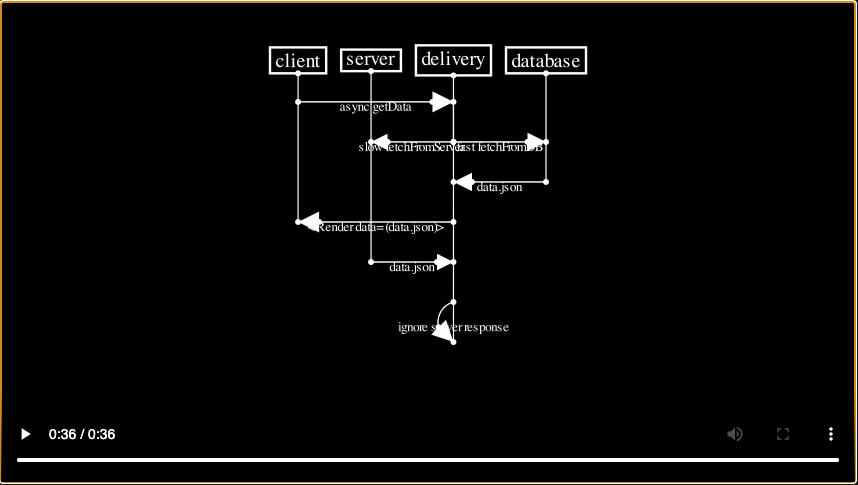

# Manim Sequence Diagrams

[](./docs/ClientRaceDatabaseNetwork.mp4)

## Installation

Following manim's guide on how to install plugins on [this guide](https://docs.manim.community/en/stable/plugins.html), but TL;DR is:

run

```sh
pip install manim-sequence-diagram
manim cfg write
```

this will generate a `manim.cfg` file somewhere, you'll need to add to it this package

```
[CLI]
enable_wireframe = False
dry_run = False
tex_template =
plugins = manim_sequence_diagram
```

You'll know if you have it working if you run

```sh
manim plugins -l
```

and it shows something like

```
Manim Community v0.16.0.post0

Plugins:
 • manim_sequence_diagram
```

### Generate Examples

```sh
manim -pql docs/examples.py ClientRaceDatabaseNetwork
```

Although one day, we'd like to support proper sequence diagram syntax, for now, it's all in python.

Here's a quick example of how it works

```python
from manim import *
from manim_sequence_diagram import *

class ClientRaceDatabaseNetwork(MovingCameraScene):
    def construct(self):
        actor_client = SeqActor(name="client")
        actor_delivery = SeqActor(name="delivery")
        actor_server = SeqActor(name="server")
        actor_db = SeqActor(name="database")
        for anime in SeqAction.introduce_actors(actor_client, actor_server, actor_delivery, actor_db):
            self.play(anime)

        # Move the camera yourself!
        self.play(self.camera.frame.animate.move_to(DOWN * 3))

        for anime in SeqAction.subject_gives_gift_to_target(
            subject=actor_client,
            gift=SeqObject(name="async getData"),
            target=actor_delivery
        ):
            self.play(anime)
```

## Development

You'll need poetry to properly get this to work, checkout their guide [here](https://python-poetry.org/docs/) for how to install. Once you do, do the following to setup

```sh
make install
make dev
```

In order to generate examples, you'll need to setup your manim cfg
